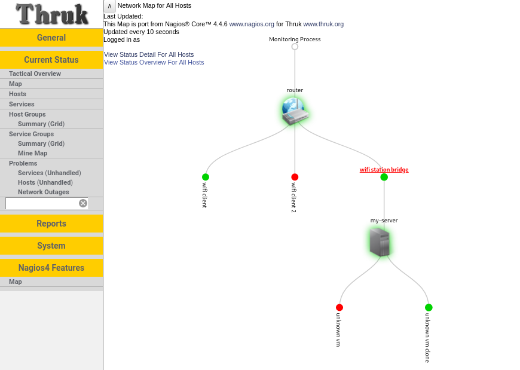

# Nagios4 Features plugin for Thruk

It's a port some UI elements and emulating some CGI scripts from Nagios® Core™ ( version 4.4.6 at moment ) ( [www.nagios.org](https://www.nagios.org/) ) for Thruk Monitoring Interface ( [thruk.org](http://thruk.org/) ).

## Project Status
- StatusMap UI element - released
- Trends UI element - To Do
- Histogram UI element - To Do
- objectjson.cgi - emulating some functionality
- statusjson.cgi - emulating some functionality

## Installation

Just move **nagios4_features** folder to Thruk **plugins_available** ( example path: /etc/thruk/plugins/plugins-available/ ), execute in shell:

    thruk plugin enable nagios4_features

and restart your web-server.

## Configuration

In your thruk_local.conf ( or thruk.conf ):

    <Component Thruk::Plugin::Nagios4_Features>
            # Valid options for the new map are as follows:
            #        0 = User-defined coordinates
            #        1 = Depth Layers (Horizontal)
            #        2 = Collapsed tree (Horizontal)
            #        3 = Balanced tree (Horizontal)
            #        4 = DON'T USE
            #        5 = Circular Markup
            #        6 = Circular Balloon
            #        7 = Balanced tree (Vertical)
            #        8 = Collapsed tree (Vertical)
            #        9 = Depth Layers (Vertical)
            #        10 = Force Map
            default_statusmap_layout = 6
    </Component>
## Actions in Thruk menu

Use Thruk Action Menu. For example add in your thruk_local.conf:

    <action_menu_items>
        hostmenu = {\
           "icon": "../themes/{{theme}}/images/dropdown.png",\
           "title": "Host Menu",\
           "menu": [\
               {\
               "icon": "../themes/{{theme}}/images/status3.gif",\
               "label": "Locate on Map from Nagios4 Features",\
               "action": "../plugins/nagios4_features/map.cgi?host=$HOSTNAME$",\
               "target": "main"\
               }\
           ]\
        }
    </action_menu_items>

    <action_menu_apply>
        hostmenu    = .*;$             # matches all hosts only
    </action_menu_apply>

## Differences between Nagios Core 4 original code
- Mostly changes - is adaptation for Thruk environment
- Added "plugin output" and some more changes in popups for StatusMap UI element 
